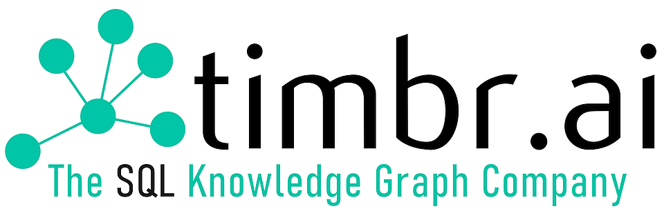
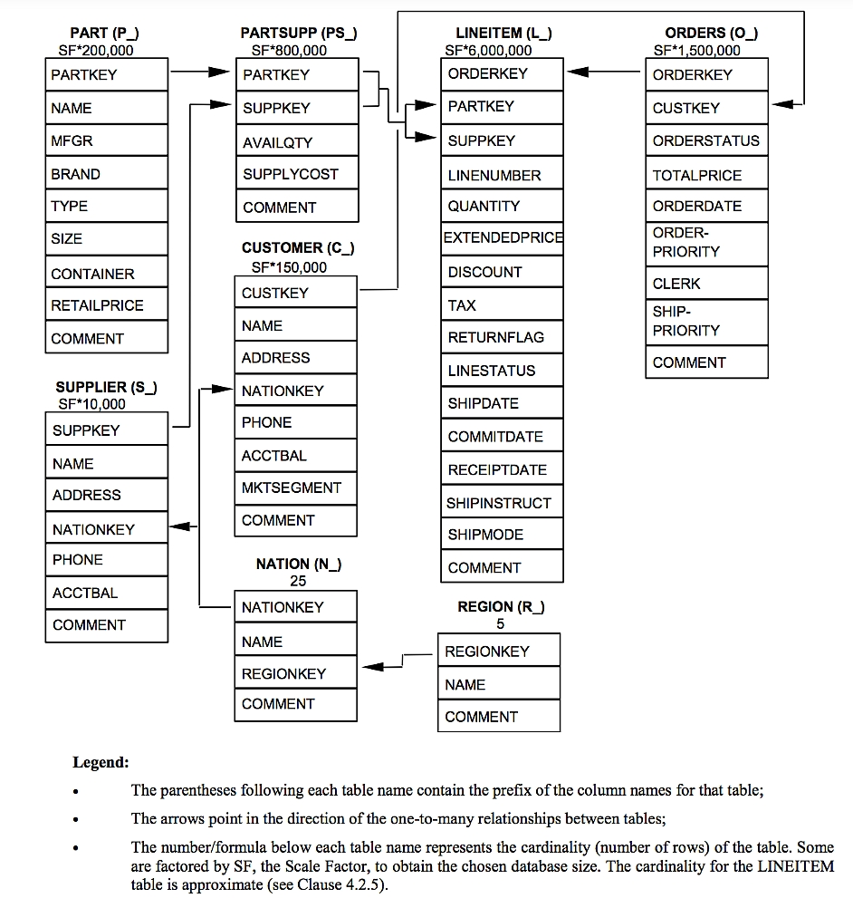
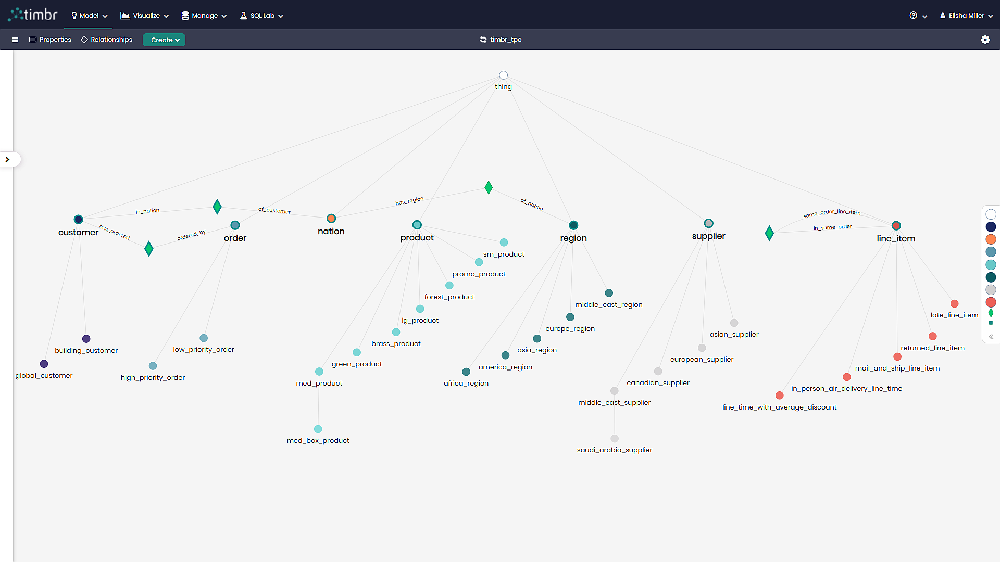

# TPC Query Complexity Benchmark

### DESCRIPTION
The TPC-H is a decision support benchmark. It consists of a suite of business oriented ad-hoc queries and concurrent data modifications. The queries and the data populating the database have been chosen to have broad industry-wide relevance. This benchmark illustrates decision support systems that examine large volumes of data, execute queries with a high degree of complexity, and give answers to critical business questions.

**Timbr** has taken the benchmark queries and with the use of Timbr’s knowledge graph has transformed these queries into simplified easy to understand queries. This was due to Timbr’s uniquely created data model, containing rich relationships, hierarchies and classifications, connecting the entire TPC dataset together. 

### The TPC ERD Model
Source: [TPC Documentation](https://www.tpc.org/tpc_documents_current_versions/pdf/tpc-h_v2.17.1.pdf). 

### The TPC Ontology
Timbr’s Ontology Modeler provides a visual interface and a SQL DDL editor to easily model concepts and properties that represent the business or use-case.

### TPC Total Query Summary Comparison
After creating the 22 TPC-H queries in Timbr and answering these queries with the use of Timbr’s knowledge graph, we went on to compare the TPC queries as-is, as well as with Timbr and we were able to identify a substantial difference in query complexity. The total comparison of all 22 queries was as follows: 

|  **Total** | With Timbr  | Without Timbr |
| :------------ |:---------------:| :-----:|
| SQL Lines     | 205 | 342 |
| SQL JOINS     | 0   | 49  |

### TPC Query Comparison

**[Q1 - Pricing Summary Report Query](https://github.com/WPSemantix/TPC_Query_Complexity_Benchmark/blob/main/TPC_Queries/TPC_Q01.sql)** - This query reports the amount of business that was billed, shipped, and returned.
| | With Timbr  | Without Timbr| 
| :------------ |:---------------| :-----|
| SQL Lines     | 14 | 14 |
| SQL JOINS     | 0   | 0  |

**[Q2 - Minimum Cost Supplier Query](https://github.com/WPSemantix/TPC_Query_Complexity_Benchmark/blob/main/TPC_Queries/TPC_Q02.sql)** - This query finds which supplier should be selected to place an order for a given part in a given region.
| | With Timbr | Without Timbr | 
| :------------ |:---------------| :-----|
| SQL Lines     | 12 | 26 |
| SQL JOINS     | 0   | 7  |

**[Q3 - Shipping Priority Query](https://github.com/WPSemantix/TPC_Query_Complexity_Benchmark/blob/main/TPC_Queries/TPC_Q03.sql)** - This query retrieves the 10 unshipped orders with the highest value.
| | With Timbr  | Without Timbr | 
| :------------ |:---------------| :-----|
| SQL Lines     | 10 | 12 |
| SQL JOINS     | 0   | 2  |

**[Q4 - Order Priority Checking Query](https://github.com/WPSemantix/TPC_Query_Complexity_Benchmark/blob/main/TPC_Queries/TPC_Q04.sql)** - This query determines how well the order priority system is working and gives an assessment of customer satisfaction.
| | With Timbr  | Without Timbr | 
| :------------ |:---------------| :-----|
| SQL Lines     | 7 | 11 |
| SQL JOINS     | 0   | 0  |

**[Q5 - Local Supplier Volume Query](https://github.com/WPSemantix/TPC_Query_Complexity_Benchmark/blob/main/TPC_Queries/TPC_Q05.sql)** - This query lists the revenue volume done through local suppliers.
| | With Timbr  | Without Timbr | 
| :------------ |:---------------| :-----|
| SQL Lines     | 7 | 13 |
| SQL JOINS     | 0   | 5  |

**[Q6 - Forecasting Revenue Change Query](https://github.com/WPSemantix/TPC_Query_Complexity_Benchmark/blob/main/TPC_Queries/TPC_Q06.sql)** - This query quantifies the amount of revenue increase that would have resulted from eliminating certain companywide discounts in a given percentage range in a given year.
| | With Timbr  | Without Timbr | 
| :------------ |:---------------| :-----|
| SQL Lines     | 4 | 6 |
| SQL JOINS     | 0   | 0  |

**[Q7 - Volume Shipping Query](https://github.com/WPSemantix/TPC_Query_Complexity_Benchmark/blob/main/TPC_Queries/TPC_Q07.sql)** - This query determines the value of goods shipped between certain nations to help in the re-negotiation of shipping contracts.
| | With Timbr  | Without Timbr | 
| :------------ |:---------------| :-----|
| SQL Lines     | 10 | 20 |
| SQL JOINS     | 0   | 5  |

**[Q8 - National Market Share Query](https://github.com/WPSemantix/TPC_Query_Complexity_Benchmark/blob/main/TPC_Queries/TPC_Q08.sql)** - This query determines how the market share of a given nation within a given region has changed over two years for a given part type.
| | With Timbr  | Without Timbr | 
| :------------ |:---------------| :-----|
| SQL Lines     | 8 | 19 |
| SQL JOINS     | 0   | 7  |

**[Q9 - Product Type Profit Measure Query](https://github.com/WPSemantix/TPC_Query_Complexity_Benchmark/blob/main/TPC_Queries/TPC_Q09.sql)** - This query determines how much profit is made on a given line of parts, broken out by supplier nation and year.
| | With Timbr  | Without Timbr | 
| :------------ |:---------------| :-----|
| SQL Lines     | 7 | 16 |
| SQL JOINS     | 0   | 5  |

**[Q10 - Returned Item Reporting Query](https://github.com/WPSemantix/TPC_Query_Complexity_Benchmark/blob/main/TPC_Queries/TPC_Q10.sql)** - The query identifies customers who might be having problems with the parts that are shipped to them.
| | With Timbr  | Without Timbr | 
| :------------ |:---------------| :-----|
| SQL Lines     | 12 | 17 |
| SQL JOINS     | 0   | 3  |

**[Q11 - Important Stock Identification Query](https://github.com/WPSemantix/TPC_Query_Complexity_Benchmark/blob/main/TPC_Queries/TPC_Q11.sql)** - This query finds the most important subset of suppliers’ stock in a given nation.
| | With Timbr  | Without Timbr | 
| :------------ |:---------------| :-----|
| SQL Lines     | 8 | 17 |
| SQL JOINS     | 0   | 2  |

**[Q12 - Shipping Modes and Order Priority Query](https://github.com/WPSemantix/TPC_Query_Complexity_Benchmark/blob/main/TPC_Queries/TPC_Q12.sql)** - This query determines whether selecting less expensive modes of shipping is negatively affecting the critical-priority orders by causing more parts to be received by customers after the committed date.
| | With Timbr  | Without Timbr | 
| :------------ |:---------------| :-----|
| SQL Lines     | 9 | 12 |
| SQL JOINS     | 0   | 1  |

**[Q13 - Customer Distribution Query](https://github.com/WPSemantix/TPC_Query_Complexity_Benchmark/blob/main/TPC_Queries/TPC_Q13.sql)** - This query seeks relationships between customers and the size of their orders.
| | With Timbr  | Without Timbr | 
| :------------ |:---------------| :-----|
| SQL Lines     | 11 | 11 |
| SQL JOINS     | 0   | 1  |

**[Q14 - Promotion Effect Query](https://github.com/WPSemantix/TPC_Query_Complexity_Benchmark/blob/main/TPC_Queries/TPC_Q14.sql)** - This query monitors the market response to a promotion such as TV advertisements or a special campaign.
| | With Timbr  | Without Timbr | 
| :------------ |:---------------| :-----|
| SQL Lines     | 4 | 5 |
| SQL JOINS     | 0   | 1  |

**[Q15 - Top Supplier Query](https://github.com/WPSemantix/TPC_Query_Complexity_Benchmark/blob/main/TPC_Queries/TPC_Q15.sql)** - This query determines the top supplier so it can be rewarded, given more business, or identified for special recognition.
| | With Timbr  | Without Timbr | 
| :------------ |:---------------| :-----|
| SQL Lines     | 15  | 25 |
| SQL JOINS     | 0   | 1  |

**[Q16 - Parts/Supplier Relationship Query](https://github.com/WPSemantix/TPC_Query_Complexity_Benchmark/blob/main/TPC_Queries/TPC_Q16.sql)** - This query finds out how many suppliers can supply parts with given attributes. It might be used, for example, to determine whether there is a sufficient number of suppliers for heavily ordered parts.
| | With Timbr  | Without Timbr | 
| :------------ |:---------------| :-----|
| SQL Lines     | 11 | 11 |
| SQL JOINS     | 0   | 1  |

**[Q17 - Small-Quantity-Order Revenue Query](https://github.com/WPSemantix/TPC_Query_Complexity_Benchmark/blob/main/TPC_Queries/TPC_Q17.sql)** - This query determines how much average yearly revenue would be lost if orders were no longer filled for small quantities of certain parts. This may reduce overhead expenses by concentrating sales on larger shipments.
| | With Timbr  | Without Timbr | 
| :------------ |:---------------| :-----|
| SQL Lines     | 4 | 10 |
| SQL JOINS     | 0   | 1  |

**[Q18 - Large Volume Customer Query](https://github.com/WPSemantix/TPC_Query_Complexity_Benchmark/blob/main/TPC_Queries/TPC_Q18.sql)** - This query ranks customers based on their having placed a large quantity order. Large quantity orders are defined as those orders whose total quantity is above a certain level.
| | With Timbr  | Without Timbr | 
| :------------ |:---------------| :-----|
| SQL Lines     | 10 | 12 |
| SQL JOINS     | 0   | 2  |

**[Q19 - Discounted Revenue Query](https://github.com/WPSemantix/TPC_Query_Complexity_Benchmark/blob/main/TPC_Queries/TPC_Q19.sql)** - This query reports the gross discounted revenue attributed to the sale of selected parts handled in a particular manner. This query is an example of code such as might be produced programmatically by a data mining tool.
| | With Timbr  | Without Timbr | 
| :------------ |:---------------| :-----|
| SQL Lines     | 11 | 21 |
| SQL JOINS     | 0   | 1  |

**[Q20 - Potential Part Promotion Query](https://github.com/WPSemantix/TPC_Query_Complexity_Benchmark/blob/main/TPC_Queries/TPC_Q20.sql)** - This query identifies suppliers in a particular nation having selected parts that may be candidates for a promotional offer.
| | With Timbr  | Without Timbr | 
| :------------ |:---------------| :-----|
| SQL Lines     | 10 | 20 |
| SQL JOINS     | 0   | 1  |

**[Q21 - Suppliers Who Kept Orders Waiting Query](https://github.com/WPSemantix/TPC_Query_Complexity_Benchmark/blob/main/TPC_Queries/TPC_Q21.sql)** - This query identifies certain suppliers who were not able to ship required parts in a timely manner.
| | With Timbr  | Without Timbr | 
| :------------ |:---------------| :-----|
| SQL Lines     | 13 | 24 |
| SQL JOINS     | 0   | 3  |

**[Q22 - Global Sales Opportunity Query](https://github.com/WPSemantix/TPC_Query_Complexity_Benchmark/blob/main/TPC_Queries/TPC_Q22.sql)** - This query identifies geographies where there are customers who may be likely to make a purchase.
| | With Timbr  | Without Timbr | 
| :------------ |:---------------| :-----|
| SQL Lines     | 8 | 20 |
| SQL JOINS     | 0   | 0  |

## FAQs & Contact Info

* [Timbr FAQs](https://timbr.ai/timbr-faqs/)  
* [Timbr Contact](https://timbr.ai/contact/)
